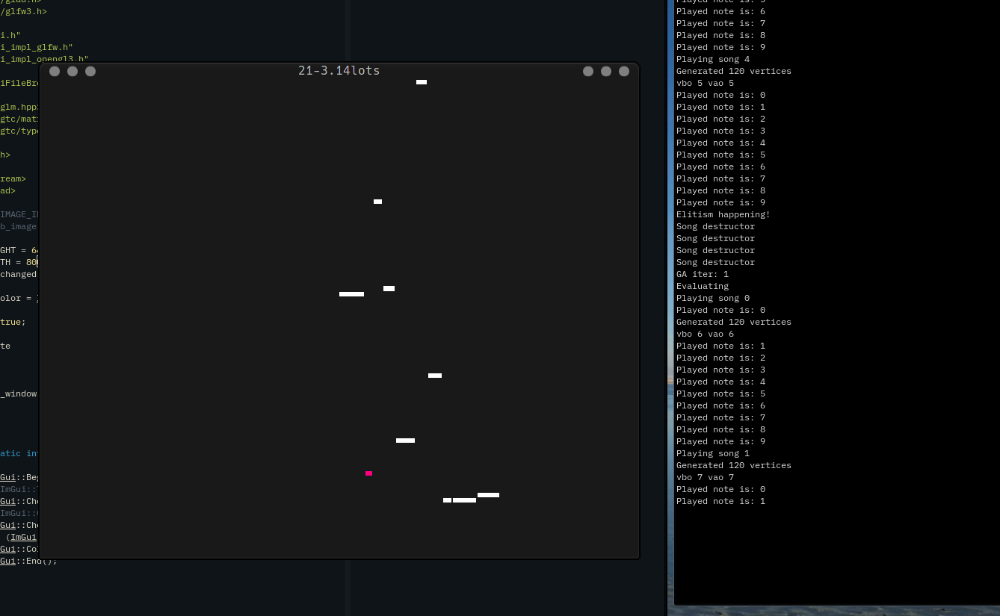

# 21-3.14lots
Genetic algorithm driven music generator.

### What is a genetic algorithm?

Is a bioinspired concept in computer science, where a population of solutions is
evaluated to achieve the best result possible. There are many techniques to
spread the good individual's genes. Currently this project implements the
'elisism' technique.

## Screenshots (actually, you should (listen)[] to it)

### To-Do

1. Implement a fitness function
2. Make a more beautiful sound

### Acknowledgements

- Sound player from [this](https://stackoverflow.com/questions/10110905/simple-sound-wave-generator-with-sdl-in-c#10111570) post on stackoverflow 
- Some [inspiration](http://www.sfu.ca/~eigenfel/arne/works/Entries/2012/4/1_Music_by_Genetic_Algorithm.html)
