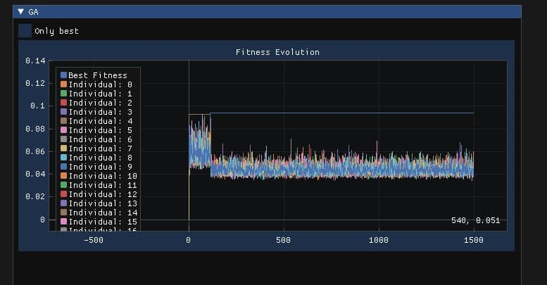

# 21-3.14lots
Genetic algorithm driven music generator created for Evolutionary Systems Applied to Robotics classes, given by Professor Eduardo do Valle Simões, at USP. The program receives a song as a parameter, calculates the amplitude of the notes and creates new songs through the standard deviation rate, keeping the same amount of notes. The algorithm keeps looking for better solutions, aiming to create songs following the pattern of the original song in the most optimized way.

The code was written in C++, using concepts of Object Oriented Programming, uses OpenGL to implement the evolutive algorithm and SDL to play the sounds of music, the ImGUI and Implot libraries were used to implement the graphical interface and plot the graph respectively.

### What is a genetic algorithm?

It is a bio-inspired concept based on the evolution of living beings, applied to computer science. where a population of solutions is created, evaluated and incresead to achieve the best result possible. 
There are many techniques to spread the good individual's genes. Currently this project implements the
'elitism' technique, that keeps only the most adapted solution (the solution with better fitness) and changes everyone else based on it.

See a quick explanation about how elitism works below:

.jpg)

The individual with best fitness spread it genes to other individuals, creating a new population with mixed features, like we can see in the next picture.

.jpg)

After that, the cycle restart.

## Screenshots (actually, you should listen to it)

### Acknowledgements

- Sound player from [this](https://stackoverflow.com/questions/10110905/simple-sound-wave-generator-with-sdl-in-c#10111570) post on stackoverflow 
- Some [inspiration](http://www.sfu.ca/~eigenfel/arne/works/Entries/2012/4/1_Music_by_Genetic_Algorithm.html)
